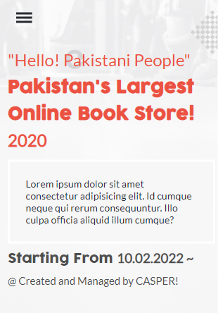
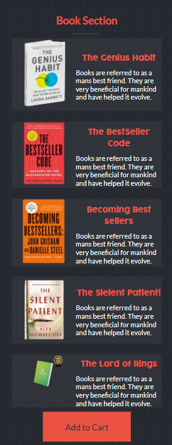
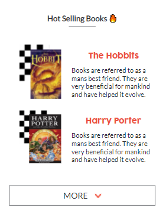
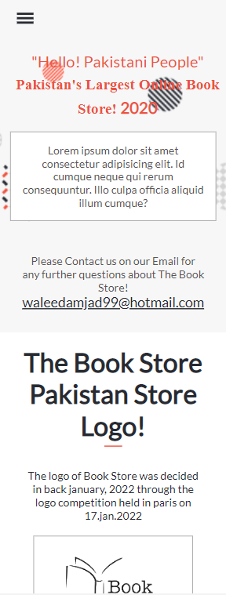
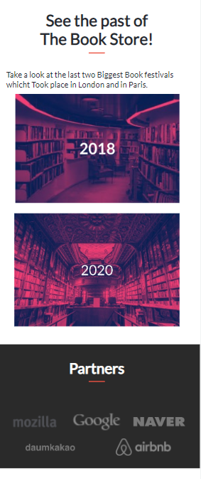
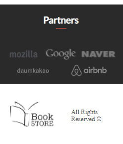

# microverse-capstone-project-one

> This is my capstone project on HTML + CSS + JAVASCRIPT. It's centred towards a Book Store and showcases the different types of Books that are available to be sold. It also makes use of dynamic Books content ib Book-Section and in Hot-Selling-Books that is coming from javascript and render into the DOM.

Homepage view                                     |  Book-Section view                             |
:------------------------------------------------:|:-----------------------------------------------:
           |  

Hot-Selling-Books View                            |  About view
:------------------------------------------------:|:-----------------------------------------------:
      |  

About second view                                 |  About footer view
:------------------------------------------------:|:-----------------------------------------------:
           |  

Desktop Landing                                  
:--------------------------------------------------------------------------------------------------:
   

## Built With

- HTML, SASS
- Grid, FlexBox is used to position the elements in DOM.
- Javascript is used to make the website Interactive.
- Linter is used to make the project useable and readble for everyone

## Live Demo (if available)

[Live Demo Link](https://caasperr.github.io/Book-Store_Website)

## Authors

👤 **Waleed Amjad**

- GitHub: [@githubhandle](https://github.com/caasperr)
-TwitterL [@developerwaleed] (https://twitter.com/developerwaleed)

## Show your support

Give a ⭐️ if you like this project!

- microverseinc for the readme template
- Julieta Ulanovsky, Sol Matas, Juan Pablo del Peral and Jacques Le Bailly from [Freepik](https://twitter.com/DeeMaejor) for the background images
- Thanks to [Cindy shin](https://www.behance.net/adagio07) for the design.

## 📝 License

All rights reserved.
